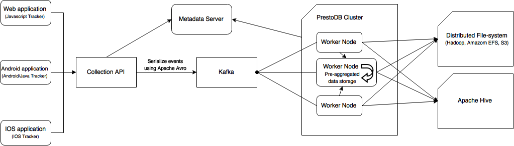

If you need a scalable solution that you can deploy to your own cluster, you may consider to use this deployment type. This deployment type uses multiple open-source software in order to process the event dataset and save it wherever you want.

## Storing Events
At first, the events are converted to a compact data structure using Apache Avro by Rakam and then they are sent to the to EventStore implementation that basically serialize that data structure and send the byte array to Kafka partitions based on their event collections. Kafka acts as distributed commit-log, we basically push all data to Kafka and periodically process and store the data in a columnar format in a distributed file-system such as Hadoop using PrestoDB.Since inserting rows one-by-one to columnar databases is not usually efficient, we use micro-batching technique using Kafka.Since it's not actually a queue, we can also replay micro-batches if the nodes fail during data processing phase.The process is basically as follows:

- Serialize event to byte sequence using Apache Avro
- Send byte sequence to Kafka based on the event collection name. (We use collection names as Kafka topics)
- Execute a query periodically that fetches data from Kafka with last offset value, de-serializes it and appends to columnar storage file.
- Execute continuous queries periodically that pulls data from Kafka, process it and update the state machine in-memory by merging the result with existing data using [presto-streaming](https://github.com/buremba/presto-streaming) connector in Presto. (Stream processing)
- Save last offset of processed rows in Kafka to metadata server.

There are multiple components in this system: metadata server (for event collection schemas and Kafka offsets), Kafka, Zookeeper, PrestoDB and Hadoop.

The Collection API handles serialization and sending events to Kafka. When events are sent to Kafka, the API send acknowledgment message to the client. Rakam uses Apache Avro for serialization and a Mysql or Postgresql metadata server for event schema registry. When a new field is sent to Rakam, the schema registry will alter the schema and update the Apache Avro schema. Currently, the system uses only one Apache Avro schema for an event collection. New fields will be appended to the schema and the updated schema will be used for the system for deserializing/serializing all the event data. If the serialized data does not have new fields (i.e. serialized using previous schema that doesn't include new field) the value of new fields will be NULL.

The master node in Rakam schedules a periodic task that execute a PrestoDB query that pulls data from Kafka using the last offset, update continious query tables using [presto-streaming](https://github.com/buremba/presto-streaming) connector in Presto and save the event dataset in columnar format in a distributed file system such as Hadoop or Amazon EFS. PrestoDB also supports Amazon S3 as backend storage.

## Analyzing Events
We re-write queries that are sent to Analysis API before executing on PrestoDB query engine in order to prevent users to execute queries on projects in which they're not authorized to access. We use PrestoDB parser written in ANTLR, and rewrite the query using AST generated by ANTLR. Similar to the other deployment types, continuous query tables use *continuous* prefix and materialized query tables use *materialized* prefix.
When the query is re-written, Rakam send the query directly to PrestoDB and it execute the query on event dataset by fetching data from distributed file-system to the worker nodes.

#### Materialized Query Tables
Fortunately, PrestoDB supports *CREATE TABLE AS* syntax that materialize query results to an external table. We use that feature internally for materialized query table. The materialized query tables uses a special prefix and stored in same schema with event collections. The query parser re-writes the table names that corresponds to the internal name of the materialized query tables. When the materialized query table is refreshed, we *DELETE* the whole table and perform the same *CREATE TABLE AS* query that materialize the last snapshot.

#### Continuous Query Tables
We use an in-house PrestoDB connector called [presto-streaming](https://github.com/buremba/presto-streaming) internally for continious processing. It uses internal PrestoDB aggregators that PrestoDB uses for aggregation queries however unlike the way PrestoDB works, the presto-streaming persists aggregators in-memory and exposes them as PrestoDB tables. We process the micro-batches periodically by fetching data from Kafka and feed the table with pre-aggregated data. The table can be thought as state machines, every time we feed the table it updates its state so that it does incremental computation. As a result, PrestoDB connector works like a stream processing engine. You can find the technical details in [presto-streaming](https://github.com/buremba/presto-streaming) page.

## Modules

##### Customer Analytics Module *[api-doc]()*
Your can plug in your user database or setup a new Postgresql database for user database. In order to be able to JOIN between event dataset and user data, you also need to add your database to PrestoDB as connector.

##### CRM module (Customer Mailbox) *[api-doc]()*
This deployment type does not offer any solution for CRM module. We suggest Postgresql for this purpose since you can use PrestoDB as event database and Postgresql for CRM module. You just need to configure the settings in config.properties file.

##### Real-time Analytics Module *[api-doc]()*
There's nothing fancy here, it uses continuous query tables under the hood.

##### Event Stream Module *[api-doc]()*
When a user subscribe an event stream, we automatically record the last offset in Kafka for the subscribed event collections.

## Master Election using Zookeeper
Since Apache Kafka already uses Zookeeper for coordination, we take advantage of Zookeeper since it's possible to elect master node easily using client libraries for Zookeeper. We use [Curator framework](https://github.com/Netflix/curator/wiki/Framework)'s master election feature that is based on Zookeeper distributed locks.
The master node takes care of Kafka offsets. It executes queries that pulls data from Kafka with last committed offset and process it on PrestoDB. If the query succeeds, it updates the last offset periodically.

